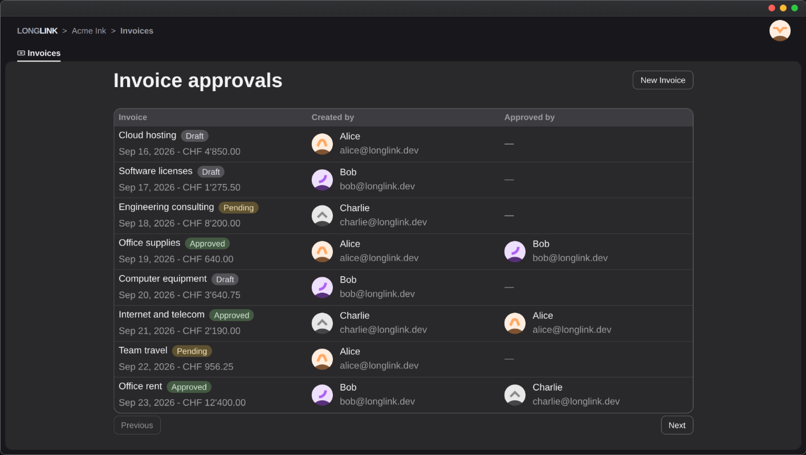

<div align="center">


<h3 >
Create the tools your company always needed
</h3 >

<a href="https://www.longlink.dev/">Website</a> &nbsp; · &nbsp; <a href="https://www.longlink.dev/docs/introduction/">Documentation</a> &nbsp; · &nbsp; <a href="https://github.com/xLongLink/sample">Sample</a> &nbsp; · &nbsp; <a href="https://pypi.org/project/longlink/">PyPI</a> &nbsp; · &nbsp; <a href="https://github.com/xLongLink/longlink/issues">Issues</a>

<a target="_blank" href="https://betalist.com/startups/longlink?utm_campaign=badge-longlink&amp;utm_medium=badge&amp;utm_source=badge-featured">
  
</a>

</div>


<br />


## Introduction

LongLink is a Python framework and platform for building and running business applications.

Write your application logic using familiar Python tools. LongLink takes care of the common infrastructure, so you can focus on solving the actual problems.

Some highlights:
- **Built on FastAPI**: Use standard FastAPI routes, Pydantic, SQLModel, and your favorite Python libraries.
- **Built-in UI**: Build modern interfaces without the complexity of maintaining a complete frontend.
- **User management**: Built-in authentication, organizations, roles, and permissions.
- **Managed infrastructure**: Databases, storage, logging, and deployment handled by the platform.
- **AI integration**: Expose your applications to AI agents through an MCP server.
- **Portable**: Applications run as standard containers.


<br />

## Create a Solution

> [!WARNING]
> LongLink is under active development. APIs may change before version 1.0.
> 
Requirements: Python 3.12 or later and [`uv`](https://docs.astral.sh/uv/).

```bash
uvx --from longlink longlink init --folder . --ci github
uv sync --group dev
uv run longlink dev
```

Open `http://127.0.0.1:1707` to preview your Solution.

> [!NOTE]
> See the [sample Solution](https://github.com/xLongLink/sample) for a complete example.

<details>
<summary>What about classic pip?</summary>

```bash
python -m pip install longlink
longlink init --folder . --ci github
python -m venv .venv
source .venv/bin/activate
python -m pip install -e .
longlink dev
```

</details>

<br />

## How it works

`LongLink()` is a headless FastAPI application with the common runtime already configured. Your routes remain standard FastAPI routes, while `Context` provides access to the current user, database, and storage.

The same code runs in development, testing, and production. When deployed, LongLink packages the Solution as a standard container image.

Each View is defined in a single file that describes its layout, elements, and actions.




<br />

## Why LongLink

AI has made custom software faster and cheaper to create. As the cost of building applications falls, more business processes can be expressed directly in software. However, without the right engineering foundations, complexity, fragility, and technical debt can gradually erode those initial benefits over time.

LongLink provides that foundation. It turns processes into maintainable business software built with Python. Each project becomes a Solution, while the Platform handles common needs: authentication, permissions, deployment, storage, logging, and governance.

Specific workflows can be customized through code, built quickly with modern AI-assisted tooling, and maintained using standard engineering practices. LongLink brings software-development principles to operational processes, making them testable, reviewable, and maintainable.


<br />

## Develop LongLink

The repository contains the LongLink SDK in `sdk/`, the Platform API in `api/`, and the frontend in `web/`.
On Linux, install the development requirements with:

```bash
make apt   # Ubuntu, Debian, ...
```

### Develop the Platform

Run these commands from the repository root:

```bash
make up     # Create local infrastructure
make api    # Start the API and leave it running
make seed   # In another terminal, after API startup completes
make web    # In the second terminal, after seeding finishes
```

`make seed` recreates `sdk/dev/`, removing any local edits in that directory.

The default development email address is `admin@admin.com`, and the password is `admin`.

### Develop the SDK runtime

Run a standalone sample Solution from the repository root:

```bash
make sdk
```

### Stop local services

Stop running development servers with **Ctrl+C** in their terminals. Then run:

```bash
make down
```

This command removes the local cluster, API database, and sample Solution in `sdk/dev/`, including any local edits in that directory.

<br />
<br />

---

<div align="center">
LongLink 2026

[License](./LICENSE) &nbsp; - &nbsp; [Contributing](./CONTRIBUTING.md) &nbsp; - &nbsp; [Code of Conduct](./CODE_OF_CONDUCT.md) &nbsp; - &nbsp; [Contact](mailto:info@longlink.dev)

</div>

---
