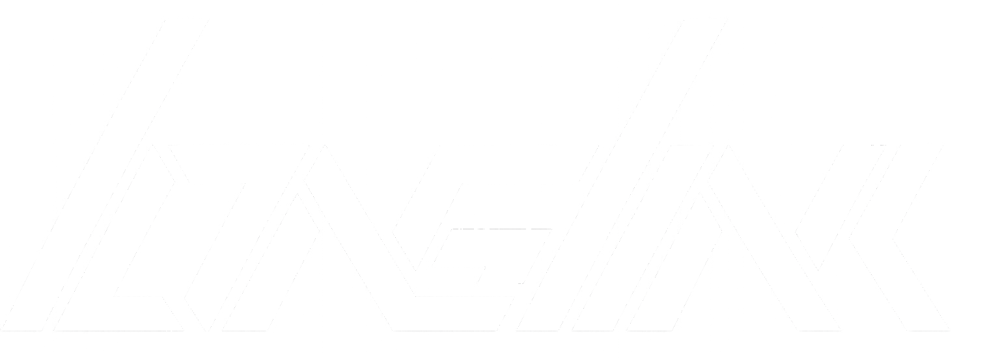

<div align="center">

<p style="font-size: 1.5em;">Control Panel</p>
</div>

## Features

- Core login of the Application.
- Handle authentication, and routing to modules.

<br />

## Development

```bash
uv venv .venv
```

Install the API in editable mode with development dependencies:

```bash
uv pip install --python .venv/bin/python -e './api[dev]'
```

## Local development

Run the API server without reload/watch mode:

```bash
cd api
DEV=True ../.venv/bin/python -m uvicorn main:app --host 0.0.0.0 --port 8000
```

## OIDC bridge environment variables

The API uses a pure OIDC bridge based on Authlib and expects these variables:

- `ENV_OIDC_ISSUER` (example: `http://localhost:8080/realms/dev`)
- `ENV_OIDC_CLIENT_ID`
- `ENV_OIDC_CLIENT_SECRET`
- `ENV_OIDC_REDIRECT_URI` (default: `http://localhost:8000/auth/oidc`)
- `ENV_OIDC_SCOPES` (default: `openid profile email`)

### Local development defaults (Keycloak)

When `DEV=true`, the API now defaults to local Keycloak bridge credentials:

- `ENV_OIDC_ISSUER=http://localhost:18080/realms/dev`
- `ENV_OIDC_CLIENT_ID=longlink-api`
- `ENV_OIDC_CLIENT_SECRET=longlink-secret`

If you run Keycloak directly on your machine (for example on `localhost:8080`) instead of the
repository `dev/compose.yml`, override `ENV_OIDC_ISSUER` in `api/.env`.

`dev/compose.yml` imports a development `dev` realm automatically
on startup, including the `longlink-api` client and `longlink-secret` credentials.
