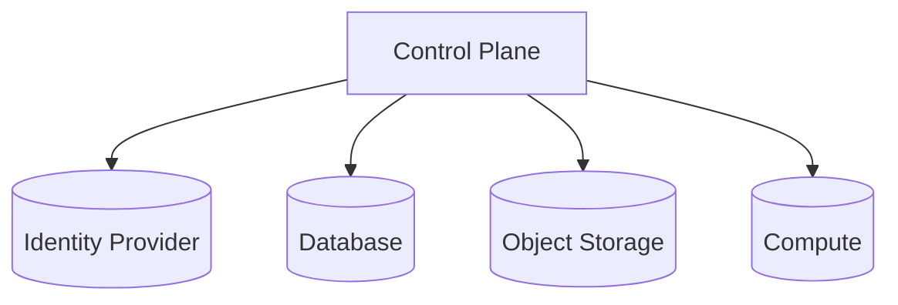
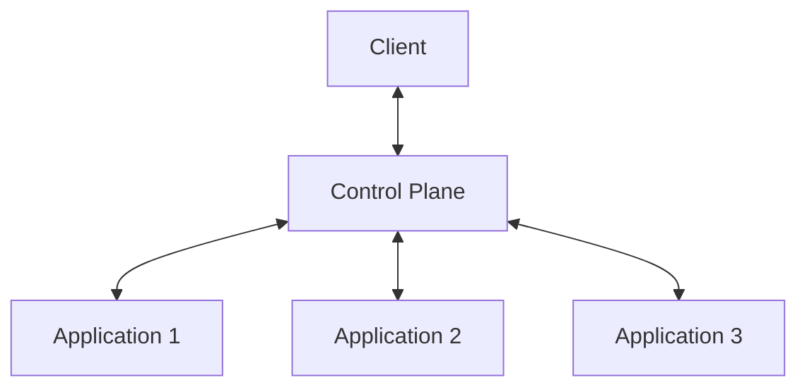

# Control Plane

The Control Plane is the central system that manages and governs all applications in LongLink. It acts as the single entry point between users and application services, handling authentication, authorization, request routing, and observability.

Applications do not interact directly with external clients. Every request flows through the control plane, ensuring that access is controlled, behavior is consistent, and all operations are traceable.

## Infrastructure

The control plane manages and connects to the core infrastructure required to run applications:

- Database (isolated per application)
- Object Storage (S3-compatible)
- Compute (Docker images running on Kubernetes)
- Identity Provider (OIDC-compatible)

 

## Request Flow & Permissioning

All interactions with applications are proxied through the control plane. It enforces authentication and permissions before routing requests and returning responses.

 

