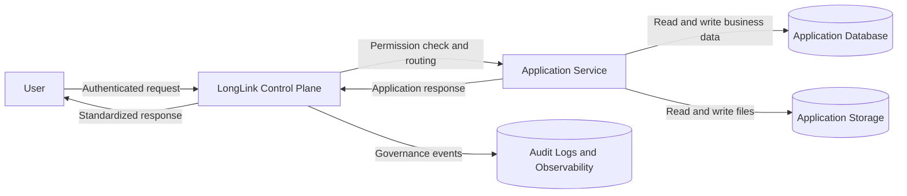

# Control Plane

The **Control Plane** is the central system that manages and governs all applications in LongLink. It provides the infrastructure, security, and coordination needed to run applications in a consistent and controlled environment.

Applications do not handle these concerns themselves—the control plane ensures they operate reliably within the platform.

## Features

The Control Plane delivers a cohesive set of platform capabilities that standardize how applications are deployed, accessed, and operated:

- **Application Management**
  Centralized registration, updates, and removal of applications, including storage of metadata and configuration.

- **Access & Identity Control**
  Integration with identity providers (OIDC), management of user sessions, and enforcement of permissions and workspace isolation.

- **Request Routing & Gateway**
  Acts as the unified entry point for all incoming traffic, handling authentication, routing, and proxying to the appropriate application while standardizing communication.

- **Data & Infrastructure Management**
  Provisioning and management of databases and storage, with logical separation per application or workspace, abstracted from application code.

- **Observability & Governance**
  Comprehensive monitoring, audit logging, and traceability to ensure visibility, compliance, and operational control.

## Role in the Architecture

All interactions with applications go through the control plane:

1. Applications are registered in the control plane
2. Users access applications through the platform
3. Requests are authenticated and routed by the control plane
4. Applications handle business logic and return responses

This ensures consistency, security, and centralized control across the system.

## Control Plane and Application Data Flow

Flow summary:

1. The user sends a request to LongLink through the control plane.
2. The control plane authenticates the user, checks permissions, and routes the request.
3. The application executes business logic and accesses its isolated database and storage.
4. The application response returns through the control plane, which also records governance and observability events.
